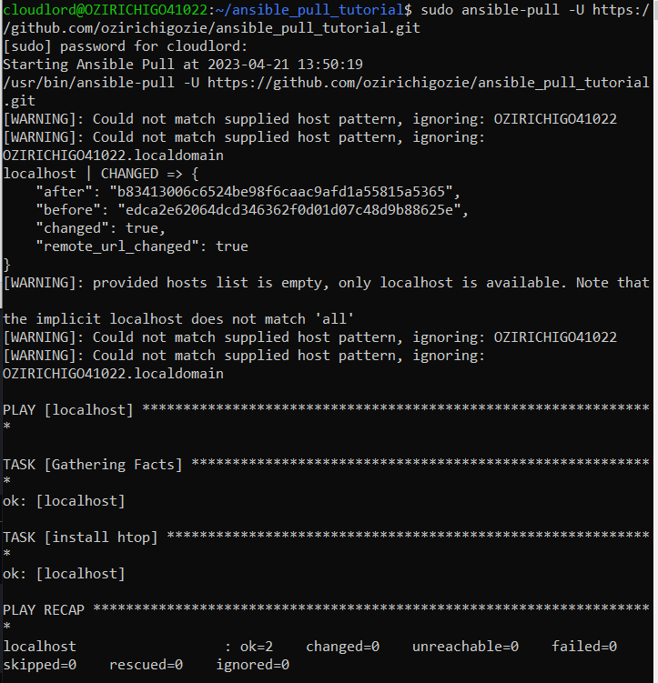

# Ansible Pull Tutorial
## This repository demonstrates the application of git with the ansible-pull command
## Follow the Steps below:
### 1. Create a git repository, and name it anything you want.
### 2. Write a Sample YAML file, specifically titled local.yml as shown below

```
- hosts: localhost
  connection: local
  become: true

  tasks:
  - name: install htop
    apt:
      name: htop
```
>
> Note: Ansible will search for a file with the name 'local.yml' when executing the `ansible-pull` command. You can also include a README.md file if you want, but that's completely optional.
>
### 3. Commit these changes to git.
### 4. Run: `sudo ansible-pull -U https:github.com/your_username/repository_name.git`
> The output of this command should be similar to the snapshot below: 
>
